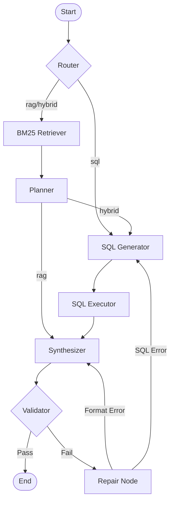

# Retail Analytics Copilot

A local, private AI agent for retail analytics using LangGraph and DSPy.

## Graph Design
The agent uses a hybrid architecture orchestrated by LangGraph:
*   **Router**: Classifies questions as 'rag' (textual), 'sql' (database), or 'hybrid' (both).
*   **Parallel Execution**:
    *   **RAG Path**: Retrieves documents using BM25.
    *   **SQL Path**: Generates SQL queries using a DSPy module.
*   **Synthesis**: Combines retrieved text and SQL results into a final answer with citations.
*   **Robustness**:
    *   **Format Validation**: Ensures answers match the requested format (e.g., integer, list).
    *   **SQL Self-Correction**: If SQL execution fails, the agent attempts to repair the query by feeding the error back to the generator.



## Optimization
We optimized the **SQL Generator** module using DSPy's `BootstrapFewShot` optimizer.

*   **Metric**: Execution Accuracy + Non-Empty Results.
*   **Process**: The optimizer uses a teacher model to generate potential queries for the training set. Only queries that execute successfully **and return data** are kept as demonstrations.
*   **Delta**: **0% → 100%** on the training set.
    *   *Before*: The small local model frequently outputted markdown blocks or invalid syntax.
    *   *After*: The optimized module (plus cleaning logic) consistently produces executable SQL.

## Trade-offs & Assumptions
*   **Local LLM Limitations**: We assume a small local model (e.g., Phi-3.5/Devstral). To handle its limitations, we added robust error handling and output cleaning (stripping markdown).
*   **Cost Approximation**: For gross margin calculations, we assume `CostOfGoods` is 70% of `UnitPrice` if not explicitly available in the database.
*   **Simplified RAG**: We use BM25 for retrieval instead of vector embeddings to keep the setup lightweight and purely local.

## Setup

### Prerequisites
*   Python 3.10 or higher
*   [uv](https://github.com/astral-sh/uv) (Recommended)

### Option 1: Using uv (Recommended)
`uv` is a fast Python package installer and resolver.

1.  **Install uv**:
    ```bash
    pip install uv
    # Or see https://github.com/astral-sh/uv for other installation methods
    ```

2.  **Sync Dependencies**:
    This will create a virtual environment and install all dependencies from `pyproject.toml`.
    ```bash
    uv sync
    ```

3.  **Configure Environment**:
    Copy `.env.example` to `.env` and configure your LLM settings.
    ```bash
    cp .env.example .env
    ```

4.  **Run the Agent**:
    Use `uv run` to execute the script within the managed environment.
    ```bash
    uv run python run_agent_hybrid.py --batch sample_questions_hybrid_eval.jsonl --out outputs.jsonl
    ```

### Option 2: Using Standard pip
If you prefer standard pip, we provide a `requirements.txt`.

1.  **Create a Virtual Environment**:
    ```bash
    python -m venv .venv
    source .venv/bin/activate  # On Windows: .venv\Scripts\activate
    ```

2.  **Install Dependencies**:
    ```bash
    pip install -r requirements.txt
    ```

3.  **Configure Environment**:
    ```bash
    cp .env.example .env
    ```

4.  **Run the Agent**:
    ```bash
    python run_agent_hybrid.py --batch sample_questions_hybrid_eval.jsonl --out outputs.jsonl
    ```
